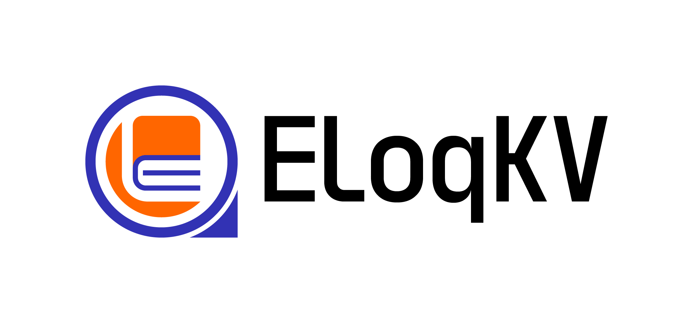
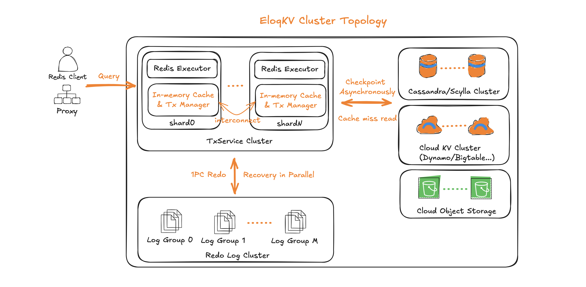
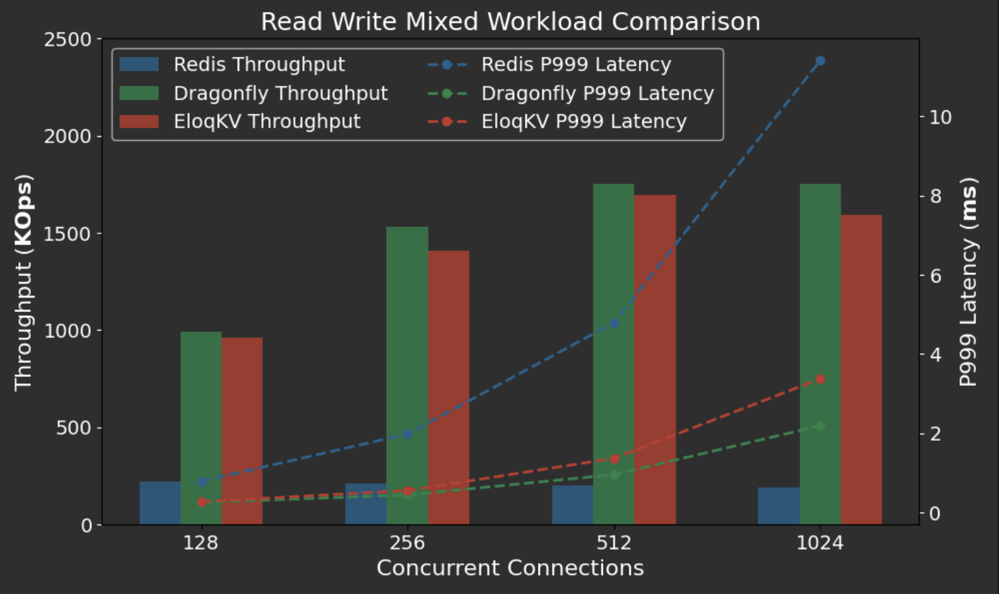
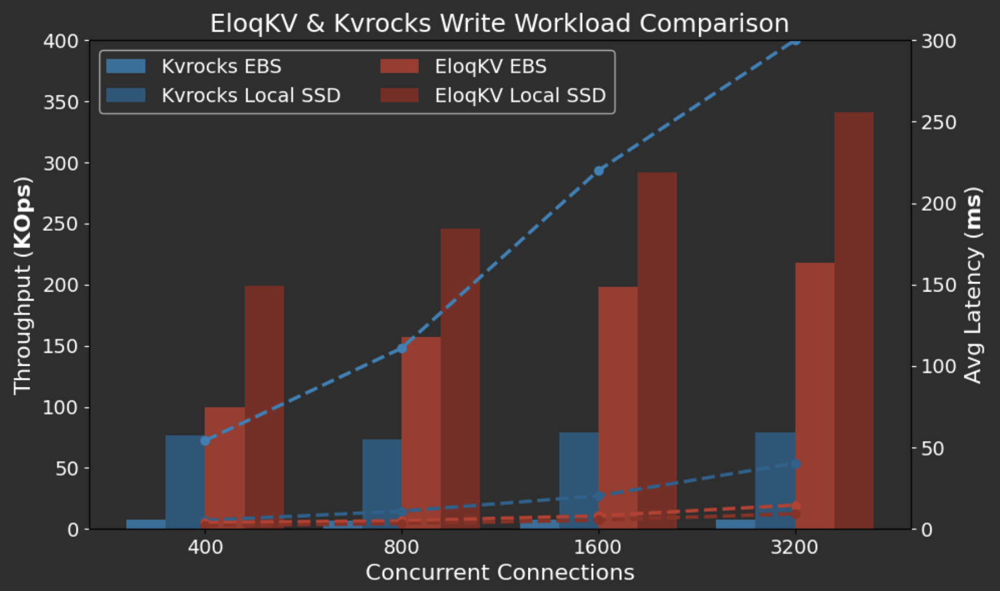

<div align="center">
<a href='https://www.eloqdata.com'>
</img>
</a>
  
---

[](https://github.com/eloqdata/eloqkv/blob/readme/LICENSE)
[](https://isocpp.org/)
[](https://github.com/eloqdata/eloqkv/issues)
[](https://www.eloqdata.com/download)
<a href="https://discord.com/invite/nmYjBkfak6">
  
</a>
</div>

# EloqKV  
EloqKV is a high performance distributed database with Redis/ValKey compatible API. It is designed for developers who need a modern no-compromise database to support the new class of demanding applications in the AI age with features like **ACID transactions, tiered storage, and Session-style syntax** — all while keeping Redis' simplicity.

- [Key Features](#key-features)
- [Quick Start](#quick-start)
- [Architecture](#architecture)
- [Benchmark](#benchmark)
- [Build From Source](#build-from-source)
- [License](#license)
- [See Also](#see-also)


**Why Choose EloqKV Over Redis?**  
| Feature                      | Redis                        | EloqKV                                        |
| ---------------------------- | ---------------------------  | -----------------------------------------     |
| **High Performance**         | Single-threaded              | Multi-threaded (1.6million QPS on c6g.8xlarge)|
| **Transactions**             | `MULTI/EXEC` (No Rollback)   | Redis API plus `BEGIN/COMMIT/ROLLBACK` (ACID) |
| **Distributed Transactions** | `CROSSSLOT` Error            | ACID distributed transactions                 |
| **Data Durability**          | Limited, AOF/RDB snapshots   | Replicated WAL + Tiered Storage               |
| **Cold Data**                | Must fit in memory           | Auto-tiering to disk                          |
| **Client Transparency**      | Cluster needs specific client| Same client for a single server or a cluster  |


---

## Key Features

### ⚡ **High Performance** 
- **Multi-threaded**: Built with thread-per-core execution and message-passing architecture to fully utilize modern multicore CPUs.
- **Single Node**: Up to **1.6M QPS** on AWS c6g.8xlarge, comparable to purpose-built cache systems like DragonflyDB and far out-performs Redis and Valkey.
- **Natively Distributed**: Scale horizontally with distributed transactions, so your application works the same whether it's backed by a single-node EloqKV or a cluster of servers.

### 🗃️ **Full Durability with Tiered Storage**  
- **WAL for True Durability**: No more data loss due to power failures.
- **Hot Data**: In-memory for microsecond access.  
- **Cold Data**: Automatically offloaded to disk.  
*Save 70% on memory costs compared to pure in-memory cache such as Redis.*  

### 🛠️ **ACID Transactions with Session-Style Syntax**
In addition to the standard (but limited) Redis transaction syntax (MULTI/EXEC), EloqKV also support Session-style interactive transactions.

```redis  
-- Transfer funds between accounts atomically  
BEGIN  
  GET user:1000:balance     	 -- returns 1000
  INCRBY user:1000:balance -500  -- returns ok
  INCRBY user:2000:balance +500  -- returns ok
COMMIT  
-- Rollback on failure  
```  
- No more Lua scripts or `MULTI` limitations — write transactions like a SQL database, with similar ACID gurantees and better performance.

### 🌐 **Distributed ACID Transactions** 
**Cross-node strong consistency without `hash slot` constraints**  
```redis  
-- Example of cross-node transfer
BEGIN  
  INCRBY user:1000:balance -500      -- node A  
  HSET order:2000:status "paid"      -- node B  
COMMIT  
```
-   **No  `CROSSSLOT`  Errors**：Enables atomic operations across multiple nodes, unlike Redis Cluster which blocks cross-slot transactions.
    
### 🔄 **Redis API Compatibility**  
```bash  
redis-cli -h eloqkv-server SET key "value"  # Works out of the box!  
```  
- Zero code changes needed. Check out our [supported Redis commands](https://www.eloqdata.com/eloqkv/kvstore_compatibility). 


---

## Quick Start
### Using Docker
We recommend using Docker for a quick local try-out of EloqKV.

**1. Start a Single Node using Docker:**  
```bash  
# Create subnet for containers.
docker network create --subnet=172.20.0.0/16 eloqnet

docker run -d --net eloqnet --ip 172.20.0.10 -p 6379:6379 --name=eloqkv eloqdata/eloqkv
```  

**2. Verify Installation:**  
```bash  
redis-cli -h 172.20.0.10

172.20.0.10:6379> set hello world
OK
172.20.0.10:6379> get hello
"world"
```  

### Run with EloqCtl
EloqCtl is the cluster management tool for EloqKV.

To deploy an EloqKV cluster in production, download [EloqCtl](https://www.eloqdata.com/downloadeloqctl) and follow the [deployment guide](https://www.eloqdata.com/eloqsql/cluster-deployment).

### Run with Tarball
Download the EloqKV tarball from the [EloqData website](https://www.eloqdata.com/download/eloqkv).

Follow the [instruction guide](https://www.eloqdata.com/eloqkv/install-from-binary) to set up and run EloqKV on your local machine.

<!---
### Try Our Cloud-Native Serverless Offering
We invite you to try our Cloud-Native Serverless offering in the managed [EloqCloud](https://cloud.eloqdata.com/). With a generous free tier offering of 25GB data storage, up to 10K QPS and scale-to-zero capability, EloqKV on EloqCloud is the easiest way to tryout EloqKV for free. 
-->

---

## Architecture


<div align="center">
<a href='https://www.eloqdata.com'>
</img>
</a>
</div>

EloqKV is a decoupled, distributed database built on [Data Substrate](https://www.eloqdata.com/blog/2024/08/11/data-substrate), the innovative new database foundation developed by EloqData.

Each EloqKV instance includes a frontend, compatible with the Redis protocol, deployed together with the core TxService to handle data operations. A logically independent LogService handles Write Ahead Logging (WAL) to ensure persistence, while a Storage Service manages memory state checkpoints and cold data storage.

<!---
In EloqKV, the TxService is responsible for concurrency control, ensuring that transactional operations are consistent. The Log Service can replicate logs and distributes them across different availability zones (AZs) to provide resilience against AZ-level failures. The storage service supports various persistent storage engines, including local options like RocksDB, remote clusters like Cassandra, and cloud storage solutions such as AWS DynamoDB and Object Storage. This persistent storage store cold data for cache misses and provide high availability, even during node failures.
-->

## Benchmark

EloqKV is a **fully featured key-value database** that supports both pure **in-memory caching** mode and **durable transactional** mode. In both use cases, it delivers outstanding performance compared to other solutions.

### Cache Mode

In cache scenarios, on a reasonable modern multi-core server EloqKV significantly outperforms Redis and ValKey and achieves performances comparable to DragonflyDB, a multi-threaded in-memory cache with Redis API. Unlike Redis and DragonflyDB, EloqKV is a full featured database that also excels in clustered, durable, and fully ACID-compliant transactional setups.
📖 [See full benchmark ](https://www.eloqdata.com/blog/2024/08/17/benchmark-single-node)


<div align="center">
<a href='https://www.eloqdata.com'>
</img>
</a>
</div>

### Persistent Transactional Mode

When running with full durability, EloqKV outperforms other Redis-compatible stores like Apache KVRocks by a large margin. Unlike these datastores that merely swap cold data to disks, EloqKV offers **real, rollback-capable transactions** with high throughput and ACID guarantees.
📖 [See full benchmark ](https://www.eloqdata.com/blog/2024/08/25/benchmark-txlog)


<div align="center">
<a href='https://www.eloqdata.com'>
</img>
</a>
</div>
  
---

## Build from Source  
### 1. Pull the Source Code and Install Dependencies
We recommend using our Docker image with pre-installed dependencies and pull EloqKV source code in the container for a quick build and run of EloqKV.

```bash
docker pull eloqdata/eloq-build-ubuntu2404:latest
docker run -it --name eloq eloqdata/eloq-build-ubuntu2404
git clone https://github.com/eloqdata/eloqkv.git
cd eloqkv
```
Alternatively, you can also pull the source code in an existing Linux environment (currently, ubuntu2404 is preferred), and manually run the script to install dependencies on your local machine. Notice that this might take a while.

```bash
git clone https://github.com/eloqdata/eloqkv.git
cd eloqkv
bash scripts/install_dependency_ubuntu2404.sh
```

### 2. Initialize Submodules
Fetch submodules and create a symbolic link from `open_log_service` to `log_service`:

```
git submodule update --init --recursive
ln -s open_log_service log_service
```

### 3. Build EloqKV
```bash
mkdir build
cd build
cmake -DCMAKE_INSTALL_PREFIX=./install ..
make -j 8
make install
```

### 4. Run EloqKV
```bash
cd install
./bin/eloqkv --port=6389
```

---

## License

EloqKV is under under a dual license. You may choose to use it under the terms of either:
1. GNU General Public License, Version 2 (GPLv2), or
2. GNU Affero General Public License, Version 3 (AGPLv3).

See the [LICENSE](./LICENSE) file for details.

---

## See Also

- [EloqKV Documentation](https://www.eloqdata.com/eloqkv/introduction)
- [Try EloqCloud for EloqKV](https://cloud.eloqdata.com)
- [Watch: EloqKV at ApacheCon](https://www.youtube.com/watch?v=33gotnJh7rc)
- [Watch: EloqKV at Monster Scale Cummit](https://www.youtube.com/watch?v=XSuwjiNt0N4)
  
[](https://github.com/eloqdata/eloqkv/stargazers)
**Star This Repo ⭐** to Support Our Journey — Every Star Helps Us Reach More Developers!  

